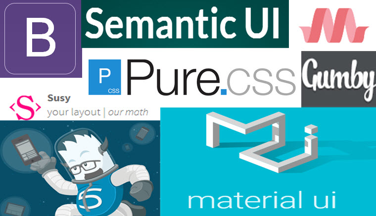

<H1>Frameworks save lives!!</H1>

I have never used a framework until this point. Personally, I think frameworks are a huge help and websites cannot be done efficiently without them. I have created a website before by just using basic HTML and CSS without any framework because I did not know how to use a framework. I accomplished the website but it took a while for very simple things that could have just taken minutes with a framework like Semantic UI. I was surprised how easy it was to use Semantic UI, if I would have known about this I definitely would have been using this already. If a developer is not using a framework, I seriously think they are putting too much work in because, based on my experience, the framework reduces the amount of work that needs to be done.
 

Although it may be a little confusing in the beginning the frustration will pay off when you know the framework, because it will be easy to develop. Also, if there needs to be changes the framework makes it easy to comprehend and understand what exactly the code is doing. Frameworks are benefiting for the developer, it cuts the time for the website and the developer can invest that time saved into implementing something else on the website. I will try some other frameworks to see which one I am most comfortable with and gain more experience with that framework.

