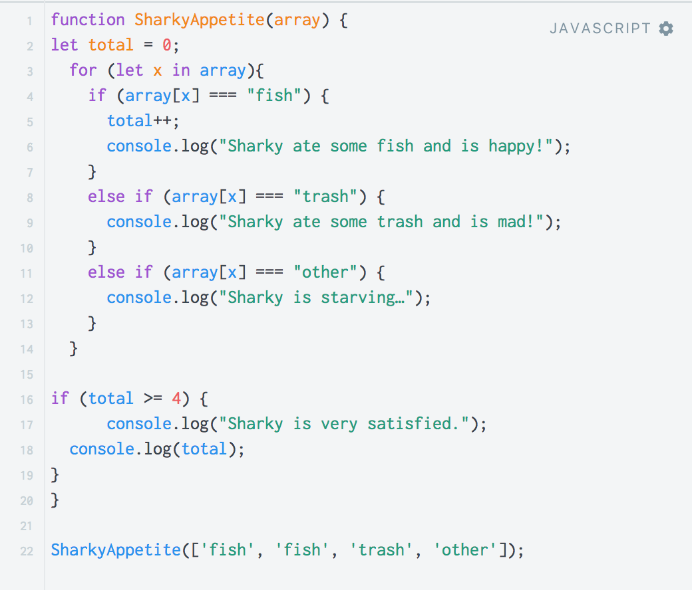

<H1>Let me tell you about JavaScript</H1>

JavaScript was a foreign language to me, meaning I have never used the language or knew how it worked until this course. Once I started to use the language I realized it was somewhat similar to Java the programming language, which made coding a lot easier because I already knew concepts and foundation. There are some differences in the language, for example: declaring variables, for loops having different ways to go through arrays, and printing the results onto a browser console, also the syntax was a little different. Although there is difference, the basics and concepts are pretty much the same. Athletic Software Engineering also helps when I do the practice Work out of the Day which are timed coding problems.

Athletic software engineering allocates the time where you learn most and uses that towards the time of the WOD, giving the WOD the most time and ability to learn and capture the content. The practice WOD’s were definitely useful and a good help towards the actual WOD however, when I do the practice WOD’s I realize I still need a little help in successfully accomplishing the tasks. The style of learning the language and concepts are pretty stressful because a lot of it is condensed.

Overall, I do enjoy JavaScript. I find it a little easier than Java, just a little confusing at times. Printing to the console is new to me but helped a tremendous amount when debugging. I know that JavaScript will be useful for me when I start developing websites and programming, I look forward to getting familiar with the language.

